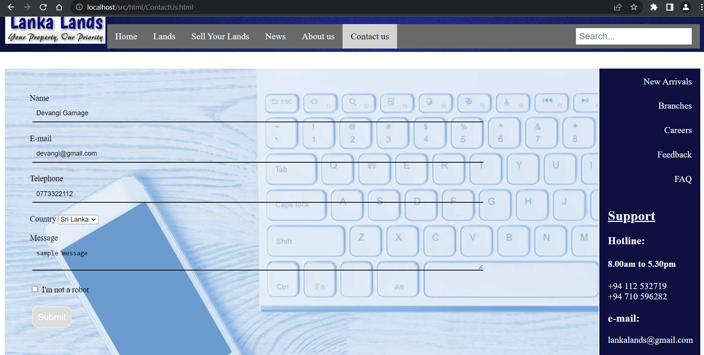

# LankaLands_Payment-Management
Group project for the 'Internet & Web Technologies' module in 2nd semester of 1st year. In this online land sales system, sellers can publish advertisements of lands and customers can reserve lands.

  

   

## Payment Management (Individual part)

   

### Adding payment details to the system.

   

### Previous details can be updated.

   

### Deleting payment details of a particular user by inserting NIC number.

   

### Retrieving payment details of a particular year.

   

### All payment details can be viewed.

   

## Tools & technologies
- HTML
- CSS
- Javascript
- PHP
- Database - MySQL

